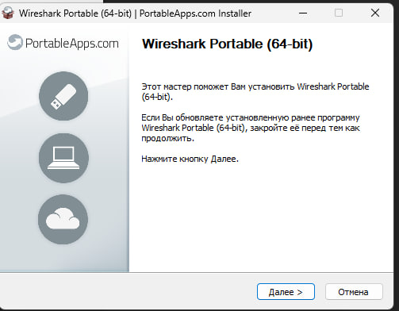
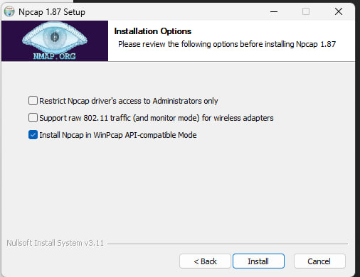
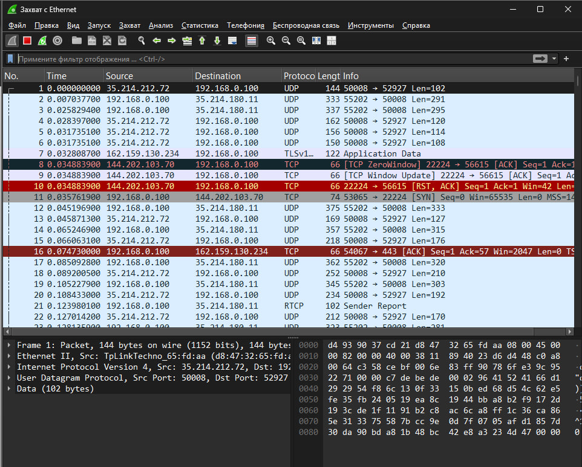
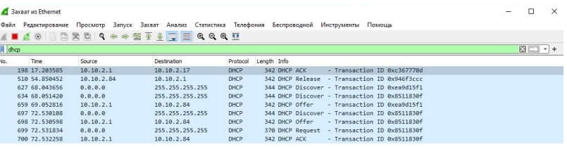

# Отчет по лабораторной работе 3.2
## Установка и первичный анализ трафика в Wireshark (ОС Windows)

**Выполнил:** Студент
**Дата:** 2026-03-10
**Среда выполнения:** ОС Windows (портативная версия)

---

### 1. Цель работы
Изучить процесс установки сетевого анализатора Wireshark на операционную систему Windows, ознакомиться с его интерфейсом и выполнить захват трафика с фильтрацией по протоколу DHCP.

---

### 2. Ход работы

#### 2.1. Загрузка дистрибутива
Для выполнения работы была выбрана **портативная версия** Wireshark, так как она не требует прав администратора для установки (хотя драйверы все равно потребуют прав) и удобна для переноса на флеш-носителе.

1. Был открыт браузер и осуществлен переход на официальный сайт Wireshark в раздел загрузок.
2. Скачан файл `WiresharkPortable64_4.6.4.paf.exe` (размер ~91,5 МБ).

   *На скриншоте ниже представлен загруженный установочный файл:*
   

#### 2.2. Установка приложения
Установка производилась через стандартный инсталлятор PortableApps.com.

1. Был запущен скачанный `.exe` файл.
2. В приветственном окне мастера установки нажата кнопка **Далее**.

   *Внешний вид инсталлятора:*
   

3. После распаковки файлов программа сообщила, что для захвата трафика необходимы драйверы Npcap.

#### 2.3. Установка драйвера Npcap
Wireshark не может захватывать пакеты напрямую, ему требуется библиотека/драйвер для низкоуровневого доступа к сети. В Windows эту функцию выполняет Npcap (наследник WinPcap).

1. Перейдя по ссылке из сообщения Wireshark, был скачан установщик Npcap.
2. В процессе установки были оставлены настройки по умолчанию, включая важную опцию: **"Install Npcap in WinPcap API-compatible Mode"** (совместимость с WinPcap), так как это обеспечивает корректную работу старых версий Wireshark и некоторых утилит.

   *Окно настроек установки Npcap:*
   

3. После завершения установки Npcap Wireshark был перезапущен.

#### 2.4. Запуск и захват трафика
После успешной установки всех компонентов программа была запущена.

1. Главное окно Wireshark отобразило список доступных сетевых интерфейсов. В отличие от Linux (где интерфейс называется `ens33`), в Windows интерфейсы имеют названия "Подключение по локальной сети", "Беспроводная сеть" и т.д.
2. Для захвата трафика был выбран активный интерфейс, смотрящий в интернет (в данном случае использовался Ethernet/Wi-Fi адаптер).

   *Пример захваченного трафика на интерфейсе (для наглядности показан дамп пакетов):*
   

#### 2.5. Фильтрация трафика (DHCP)
Для проверки работоспособности фильтров была выполнена стандартная лабораторная задача — отлов DHCP-пакетов.

1. В поле фильтра (находится под панелью инструментов) был введен протокол `dhcp`.
   *Первоначально список пакетов был пуст, так как в сети не происходило DHCP-событий.*

2. Для принудительной генерации DHCP-трафика были выполнены следующие действия (согласно методичке):
   - Открыты "Параметры сети и Интернет" Windows.
   - Перейдено в "Настройки параметров адаптера".
   - Выбран целевой сетевой адаптер.
   - Правой кнопкой мыши выполнена команда **"Отключить"**, а затем **"Включить"**.

3. После перезапуска адаптера в окне Wireshark отобразились все стадии DHCP:
   - **Discover** (поиск DHCP-сервера)
   - **Offer** (предложение адреса)
   - **Request** (запрос адреса)
   - **ACK** (подтверждение)

   *Результат работы фильтра `dhcp` — отображаются только пакеты DHCP:*
   

---

### 3. Выводы

В ходе выполнения лабораторной работы были получены практические навыки установки и настройки программного комплекса Wireshark в среде Windows.

**Основные результаты:**
1. Установлена портативная версия Wireshark.
2. Отдельно установлен и настроен драйвер **Npcap**, являющийся обязательным компонентом для захвата трафика в Windows.
3. Произведен захват сетевого трафика.
4. Успешно применен фильтр отображения **`dhcp`**, что позволило наблюдать процесс получения IP-адреса устройством в реальном времени.
5. Зафиксировано различие в именовании сетевых интерфейсов между Windows (локализованные названия) и Ubuntu (`ens33`), что важно учитывать при чтении методических материалов.

Wireshark является незаменимым инструментом для сетевых инженеров и администраторов, позволяя детально анализировать проблемы сети и изучать взаимодействие протоколов.
